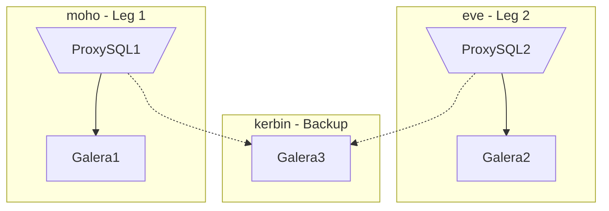

# MariaDB-Stack
A simplified, reference implementation of a database stack, deployed using a Docker Swarm consisting of a three node MariaDB Galera cluster, using ProxySQL to provide load balancing, and PMM to provide monitoring.

## Example Deployment (AWS)

The example deployment utilizes three AWS EC2 instances running the Ubuntu distribution. The sample configuration is as small as possible and not practical for most production loads.

### Instances
| Hostname | Instance Type    | Availability Zone | Operating System      | Description               |
| :------- | :--------------- | :---------------- |:--------------------- | :-------------------------|
| `moho`   | `t3a.small 2GB`  | `us-east-1a`      | `Ubuntu 20.04.01 LTS` | `galera1` and `proxysql1` |
| `eve`    | `t3a.small 2GB`  | `us-east-1b`      | `Ubuntu 20.04.01 LTS` | `galera2` and `proxysql2` |
| `kerbin` | `t3a.medium 4GB` | `us-east-1c`      | `Ubuntu 20.04.01 LTS` | `galera3` and `pmm`       |

## 1. Setup Swarms
### 1.1 Create the Security Group
| Port/Protocol | Source               | Description                   |
| ------------: | :------------------- | :---------------------------- |
| `22/TCP`      | `XXX.XXX.XXX.XXX/32` | SSH for Administration        |
| `6033/TCP`    | `XXX.XXX.XXX.XXX/32` | ProxySQL Traffic              |
| `2377/TCP`    | `172.31.0.0/16`      | Docker Swarm                  |
| `7946/TCP`    | `172.31.0.0/16`      | Docker Swarm                  |
| `7946/UDP`    | `172.31.0.0/16`      | Docker Swarm                  |
| `4789/UDP`    | `172.31.0.0/16`      | Docker Swarm                  |
| `2049/TCP`    | `172.31.0.0/16`      | NFS for EFS                   |

### 1.2 Create the EFS Volume
Create a `General Pupose` EFS volume for the `backup` volume.

### 1.3 Create the IAM Policy and Role `dns-updater` / `dns-updater-role`
```JSON
{
    "Version": "2012-10-17",
    "Statement":[
        {
            "Effect": "Allow",
            "Action": "ec2:Describe*",
            "Resource": "*"
        },
        {
            "Action":[
                "route53:ChangeResourceRecordSets",
                "route53:GetHostedZone",
                "route53:ListResourceRecordSets"
            ],
            "Effect":"Allow",
            "Resource":[
            "arn:aws:route53:::hostedzone/<Your zone ID>"
            ]
        },
        {
            "Action":[
                "route53:ListHostedZones",
                "route53:ListHostedZonesByName"
            ],
            "Effect":"Allow",
            "Resource":[
            "*"
            ]
        }
    ]
}
```

### 1.4 Create the `moho` Instance
- "T2/T3 Unlimited": disabled
- "Add file system": `backup` created above as `/mnt/backup`
- "Add storage": based on the table below:
- "Add tags": "Name" and "Domain" with the desired Hostname and Domain.

| Hostname    | Device           | Size | Description         |
| :---------- | :--------------- | ---: |:------------------- |
| `all`       | `/dev/nvme0n1p1` | 8GB  | `/`                 |
| `all`       | `/dev/nvme1n1`   | 1GB  | `/var/lib/mysql`    |
| `moho/eve`  | `/dev/nvme2n1`   | 1GB  | `/var/lib/proxysql` |
| `kerbin`    | `/dev/nvme2n1`   | 10GB | `/srv`              |

### 1.5 Clone `git` Repository
```bash
sudo chown -R ubuntu:ubuntu /mnt/backup
git clone --single-branch --branch 0.1.4 https://github.com/ckmjreynolds/MariaDB-Stack.git

# Add to ~/.profile.
export PATH="$PATH:/mnt/backup/MariaDB-Stack/script"
```

### 1.6 Setup Route 53 Registration
```bash
# Install packages.
sudo apt-get update
sudo apt-get install cloud-utils ec2-api-tools

# Install cli53.
sudo cp /mnt/backup/MariaDB-Stack/install/cli53-linux-amd64 /usr/local/bin/cli53
sudo chmod +x /usr/local/bin/cli53

# Install registerRoute53.sh script.
sudo cp /mnt/backup/MariaDB-Stack/script/registerRoute53.sh /usr/local/bin/registerRoute53.sh
sudo chmod +x /usr/local/bin/registerRoute53.sh

# Schedule the script to run on reboot.
crontab -e
@reboot /usr/local/bin/registerRoute53.sh

# Reboot the server and verify DNS entry is added/updated.
sudo reboot
```

### 1.7 Install Docker
#### Install Packages
```bash
sudo apt-get update
sudo apt-get install docker.io
```

#### Configure Docker
```bash
sudo usermod -aG docker $USER

# Log out and log back in.
docker run hello-world
docker rm -f $(docker ps -aq)
docker rmi hello-world:latest
```

### 1.8 Install `pmm-client`
```bash
# Setup repository
wget https://repo.percona.com/apt/percona-release_latest.generic_all.deb
sudo dpkg -i percona-release_latest.generic_all.deb
rm percona-release_latest.generic_all.deb

# Install the client
sudo apt-get update
sudo apt-get install pmm2-client
```

### 1.9 Patch and Create AMI
```bash
sudo apt-get update
sudo apt-get upgrade
sudo shutdown
# Create AMI in EC2 Managment Console
```

### 1.10 Create Remaining Nodes
Repeat the following step using the new AMI to create the remaining nodes.
- [1.4 Create the Instance](#14-create-the-moho-instance)

### 1.11 Setup Docker Swarm
Setup the Docker swarm.
```bash
# On moho
docker swarm init
docker swarm join-token manager

# On remaining nodes, join as a worker or manager.
docker swarm join --token <token> <ip>:2377
```

### 1.12 Format and Mount Drives
```bash
# NAME        MAJ:MIN RM  SIZE RO TYPE MOUNTPOINT
# nvme1n1     259:0    0    1G  0 disk 
# nvme2n1     259:1    0    1G  0 disk
# NOTE: nvme2n1 is 10G on kerbin
sudo mkfs --type=ext4 /dev/nvme1n1
sudo mkfs --type=ext4 /dev/nvme2n1

# moho, eve, and kerbin
sudo mkdir /var/lib/mysql
sudo mount /dev/nvme1n1 /var/lib/mysql

# moho and eve
sudo mkdir /var/lib/proxysql
sudo mount /dev/nvme2n1 /var/lib/proxysql

# kerbin
sudo mkdir /var/lib/pmm
sudo mount /dev/nvme2n1 /var/lib/pmm
```


### 0. Prerequisites
It is assumed that the reader has a working knowledge of AWS EC2 and Docker.
1. Create the [Security Group](#security-group).
2. Create [EFS Volume](#efs-volume).
3. Create the `moho` instance.
4. Create and assign Elastic IP and DNS aliases.
5. Create CloudWatch monitor(s).
6. [Install Docker](#install-docker).
7. Patch the node.
8. Create an AMI
9. Create the other nodes using the AMI.
10. Set Hostname: `sudo hostnamectl set-hostname <name>`
11. [Setup Docker Swarm](#setup-docker-swarm)
12. (Optional) [Setup Portainer](#setup-portainer)

### 1. Copy Files
```bash
scp docker-compose.yml ubuntu@moho:~/galera/docker-compose.yml
scp Testing/mysql ubuntu@moho:~/galera/mysql
scp Testing/monitor.sh ubuntu@moho:~/galera/monitor.sh
```

### 2. Create Secrets
```bash
echo <password>|docker secret create MYSQL_ROOT_PASSWORD -
echo <password>|docker secret create PROXYSQL_ADMIN_PASSWORD -
echo <password>|docker secret create PROXYSQL_USER_PASSWORD -
```

### 3. Deploy the Stack (`moho`)
```bash
# 1. Deploy the stack (also Bootstraps the clutser).
cd ~/galera
docker stack deploy -c docker-compose.yml galera

# 2. Add alexandria to the cluster.
docker service scale galera_alexandria=1

# 3. Add pergamum to the cluster.
docker service scale galera_pergamum=1

# 4. Crude monitoring.
./monitor.sh <password>
```

### 4. Schedule Backup
```bash
ssh ubuntu@kerbin
crontab -e
# m h  dom mon dow   command
0 8 * * * docker exec $(docker ps -q --filter NAME=galera_pergamum) /usr/local/bin/backup.sh
```

## Appendix

### Security Group
| Port/Protocol | Source               | Description                   |
| ------------: | :------------------- | :---------------------------- |
| `22/TCP`      | `XXX.XXX.XXX.XXX/32` | SSH for Administration        |
| `6033/TCP`    | `XXX.XXX.XXX.XXX/32` | ProxySQL Traffic              |
| `2377/TCP`    | `172.31.0.0/16`      | Docker Swarm                  |
| `7946/TCP`    | `172.31.0.0/16`      | Docker Swarm                  |
| `7946/UDP`    | `172.31.0.0/16`      | Docker Swarm                  |
| `4789/UDP`    | `172.31.0.0/16`      | Docker Swarm                  |
| `2049/TCP`    | `172.31.0.0/16`      | NFS for EFS                   |

### EFS volume
Create EFS volume for the `backup` volume.
1. Create a `General Purpose` EFS volume.

### Install Docker
#### Install Packages
```bash
sudo apt-get update
sudo apt-get install docker.io nfs-common
```

#### Configure Docker
```bash
sudo usermod -aG docker $USER

# Log out and log back in.
docker run hello-world
docker rm -f $(docker ps -aq)
docker rmi hello-world:latest
```

### Setup Docker Swarm
```bash
# On moho
docker swarm init
docker swarm join-token manager

# On remaining nodes, join as a worker or manager.
docker swarm join --token <token> <ip>:2377
```

### Setup Portainer
```bash
# On moho
curl -L https://downloads.portainer.io/portainer-agent-stack.yml -o portainer-agent-stack.yml
docker stack deploy --compose-file=portainer-agent-stack.yml portainer
```
