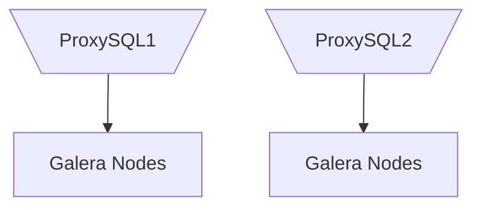

# MariaDB-Stack
A simplified, reference implementation of a database stack consisting of two three-node Galera clusters running MariaDB, two three-node ProxySQL clusters to provide load balancing, and PMM to provide monitoring.

## Example Deployment (AWS)

The example deployment utilizes seven AWS EC2 instances. The sample configuration is as small as possible and not practical for production loads.

### Instances
| Hostname | Instance Type    | Availability Zone | Operating System      | Description               |
| :------- | :--------------- | :---------------- |:--------------------- | :-------------------------|
| `kerbin` | `t3.small 2GB`   | `us-east-1c`      | `Ubuntu 20.04.01 LTS` | PMM from AWS Marketplace  |
| `moho`   | `t3a.small 2GB`  | `us-east-1a`      | `Ubuntu 20.04.01 LTS` | `MariaDB` and `ProxySQL`  |
| `eve`    | `t3a.small 2GB`  | `us-east-1a`      | `Ubuntu 20.04.01 LTS` | `MariaDB` and `ProxySQL`  |
| `duna`   | `t3a.small 2GB`  | `us-east-1a`      | `Ubuntu 20.04.01 LTS` | `MariaDB` and `ProxySQL`  |
| `dres`   | `t3a.small 2GB`  | `us-east-1b`      | `Ubuntu 20.04.01 LTS` | `MariaDB` and `ProxySQL`  |
| `jool`   | `t3a.small 2GB`  | `us-east-1b`      | `Ubuntu 20.04.01 LTS` | `MariaDB` and `ProxySQL`  |
| `eeloo`  | `t3a.small 2GB`  | `us-east-1b`      | `Ubuntu 20.04.01 LTS` | `MariaDB` and `ProxySQL`  |

## 1. Setup Nodes
### 1.1 Create the Security Group
| Port/Protocol | Source               | Description                   |
| ------------: | :------------------- | :---------------------------- |
| `22/TCP`      | `XXX.XXX.XXX.XXX/32` | SSH for Administration        |
| `433/TCP`     | `XXX.XXX.XXX.XXX/32` | HTTPS for Administration      |


### 1.2 Create the EFS Volume
Create a `General Pupose` EFS volume for the `backup` volume.

### 1.3 Create the IAM Policy and Role `dns-updater` / `dns-updater-role`
```JSON
{
    "Version": "2012-10-17",
    "Statement":[
        {
            "Effect": "Allow",
            "Action": "ec2:Describe*",
            "Resource": "*"
        },
        {
            "Action":[
                "route53:ChangeResourceRecordSets",
                "route53:GetHostedZone",
                "route53:ListResourceRecordSets"
            ],
            "Effect":"Allow",
            "Resource":[
            "arn:aws:route53:::hostedzone/<Your zone ID>"
            ]
        },
        {
            "Action":[
                "route53:ListHostedZones",
                "route53:ListHostedZonesByName"
            ],
            "Effect":"Allow",
            "Resource":[
            "*"
            ]
        }
    ]
}
```

### 1.4 Setup PMM
Follow the instructions [here](https://www.percona.com/doc/percona-monitoring-and-management/2.x/install/aws.html) to setup PMM using the AWS Marketplace.

### 1.5 Create the `moho` Instance
- "T2/T3 Unlimited": disabled
- "Add file system": `backup` created above as `/mnt/backup`
- "Add storage": based on the table below:
- "Add tags": "Name" and "Domain" with the desired Hostname and Domain.

| Hostname    | Device           | Size | Description         |
| :---------- | :--------------- | ---: |:------------------- |
| `all`       | `/dev/nvme0n1p1` | 8GB  | `/`                 |
| `all`       | `/dev/nvme1n1`   | 10GB | `/var/lib/mysql`    |
| `all`       | `/dev/nvme2n1`   | 1GB  | `/var/lib/proxysql` |

### 1.6 Clone `git` Repository
```bash
sudo chown -R ubuntu:ubuntu /mnt/backup
cd /mnt/backup
sudo rm -rf /mnt/backup/*
git clone --single-branch --branch 0.1.4 https://github.com/ckmjreynolds/MariaDB-Stack.git

# Add to ~/.profile.
export PATH="$PATH:/mnt/backup/MariaDB-Stack/script"
```

### 1.7 Setup Route 53 Registration
```bash
# Install packages.
sudo apt-get update
sudo apt-get install cloud-utils ec2-api-tools

# Install cli53.
sudo cp /mnt/backup/MariaDB-Stack/install/cli53-linux-amd64 /usr/local/bin/cli53
sudo chmod +x /usr/local/bin/cli53

# Install registerRoute53.sh script.
sudo cp /mnt/backup/MariaDB-Stack/script/registerRoute53.sh /usr/local/bin/registerRoute53.sh
sudo chmod +x /usr/local/bin/registerRoute53.sh

# Schedule the script to run on reboot.
crontab -e
@reboot /usr/local/bin/registerRoute53.sh

# Reboot the server and verify DNS entry is added/updated.
sudo reboot
```

### 1.8 Format and Mount Drives
```bash
# Format the EBS drives.
sudo mkfs --type=ext4 /dev/nvme1n1
sudo mkfs --type=ext4 /dev/nvme2n1

# Create the directories to mount to.
sudo mkdir /var/lib/mysql
sudo mkdir /var/lib/proxysql

# Mount the EBS drives.
sudo mount /dev/nvme1n1 /var/lib/mysql
sudo mount /dev/nvme2n1 /var/lib/proxysql

# Edit /etc/fstab
# <device>                                      <dir>                   <type> <options> <dump> <fsck>
UUID=136d9046-6f47-4cb4-a4b0-e671c06cc2ce       /var/lib/mysql          ext4   defaults  0      2
UUID=b680e94c-ab74-4afe-92d6-1f538466304b       /var/lib/proxysql       ext4   defaults  0      2
```

### 1.9 Install MariaDB
#### Setup Repository and Install
```bash
curl -LsS https://downloads.mariadb.com/MariaDB/mariadb_repo_setup | sudo bash -s -- --skip-maxscale --skip-tools
sudo apt-get install mariadb-server galera-4 mariadb-client libmariadb3 mariadb-backup mariadb-common
sudo mysql_secure_installation

# Stop and disable MariaDB for now.
sudo systemctl stop mariadb
sudo systemctl disable mariadb
```

### 1.10 Install ProxySQL
#### Setup Repository and Install
```bash
# https://www.percona.com/doc/percona-server/LATEST/installation/apt_repo.html
wget https://repo.percona.com/apt/percona-release_latest.$(lsb_release -sc)_all.deb
sudo dpkg -i percona-release_latest.$(lsb_release -sc)_all.deb
sudo apt-get update
sudo apt-get install proxysql2

# Disable ProxySQL for now.
sudo systemctl disable proxysql
```

### 1.11 Install PMM Client
```bash
# https://www.percona.com/doc/percona-server/LATEST/installation/apt_repo.html
sudo apt-get update
sudo apt-get install pmm2-client
```

### 1.12 Patch and Create AMI
```bash
sudo apt-get update
sudo apt-get upgrade
sudo shutdown

# Create AMI in EC2 Managment Console
```

### 1.13 Create Remaining Nodes
Repeat the following step using the new AMI to create the remaining nodes.
- [1.5 Create the Instance](#15-create-the-moho-instance)

### 1.14 Configure and Bootstrap Galera on `moho`
```bash
configureNode.sh moho.slug.mobi 100 1 "gcomm://moho.slug.mobi,eve.slug.mobi,duna.slug.mobi" 1 1000 "password"

# Bootstrap the first node on each cluster only.
sudo systemctl enable mariadb
sudo galera_new_cluster
```

### 1.15 Create the DB Users
```bash
configureUsers.sh password password password
sudo mysql
MariaDB [(none)]> SOURCE MariaDB-Stack/initdb.d/001_CREATE_USERS.sql
MariaDB [(none)]> exit
```

### 1.16 Add Monitoring
```bash
sudo pmm-admin config --server-insecure-tls --server-url=https://admin:<password>@kerbin.slug.mobi:443
pmm-admin add mysql --username=pmm --password=password --query-source=perfschema moho.slug.mobi:3306
```

### 1.17 Configure and Start Galera on `eve`
```bash
configureNode.sh eve.slug.mobi 200 2 "gcomm://moho.slug.mobi,eve.slug.mobi,duna.slug.mobi" 1 1000 "password"

# Simply start the other nodes.
sudo systemctl enable mariadb
sudo systemctl start mariadb

sudo pmm-admin config --server-insecure-tls --server-url=https://admin:<password>@kerbin.slug.mobi:443
pmm-admin add mysql --username=pmm --password=password --query-source=perfschema eve.slug.mobi:3306
```

### 1.18 Configure and Start Galera on `duna`
```bash
configureNode.sh duna.slug.mobi 300 3 "gcomm://moho.slug.mobi,eve.slug.mobi,duna.slug.mobi" 1 1000 "password"

# Simply start the other nodes.
sudo systemctl enable mariadb
sudo systemctl start mariadb

sudo pmm-admin config --server-insecure-tls --server-url=https://admin:<password>@kerbin.slug.mobi:443
pmm-admin add mysql --username=pmm --password=password --query-source=perfschema duna.slug.mobi:3306
```

### 1.19 Backup and Restore `moho` to `dres`
```bash
# Moho
sudo mariabackup --backup --target-dir=/mnt/backup/moho --user=mariabackup --password=password
sudo mariabackup --prepare --target-dir=/mnt/backup/moho

# Dres
sudo rm -rf /var/lib/mysql/*
sudo mariabackup --copy-back --target-dir=/mnt/backup/moho
sudo chown -R mysql:mysql /var/lib/mysql/
```

### 1.20 Configure and Bootstrap Galera on `dres`
```bash
configureNode.sh dres.slug.mobi 400 4 "gcomm://dres.slug.mobi,jool.slug.mobi,eeloo.slug.mobi" 2 2000 "password"

# Bootstrap the first node on each cluster only.
sudo systemctl enable mariadb
sudo galera_new_cluster
```

### 1.21 Add Monitoring
```bash
sudo pmm-admin config --server-insecure-tls --server-url=https://admin:<password>@kerbin.slug.mobi:443
pmm-admin add mysql --username=pmm --password=password --query-source=perfschema dres.slug.mobi:3306
```

### 1.22 Configure and Start Galera on `jool`
```bash
configureNode.sh jool.slug.mobi 500 5 "gcomm://dres.slug.mobi,jool.slug.mobi,eeloo.slug.mobi" 2 2000 "password"

# Simply start the other nodes.
sudo systemctl enable mariadb
sudo systemctl start mariadb

sudo pmm-admin config --server-insecure-tls --server-url=https://admin:<password>@kerbin.slug.mobi:443
pmm-admin add mysql --username=pmm --password=password --query-source=perfschema jool.slug.mobi:3306
```

### 1.23 Configure and Start Galera on `eeloo`
```bash
configureNode.sh eeloo.slug.mobi 600 6 "gcomm://dres.slug.mobi,jool.slug.mobi,eeloo.slug.mobi" 2 2000 "password"

# Simply start the other nodes.
sudo systemctl enable mariadb
sudo systemctl start mariadb

sudo pmm-admin config --server-insecure-tls --server-url=https://admin:<password>@kerbin.slug.mobi:443
pmm-admin add mysql --username=pmm --password=password --query-source=perfschema eeloo.slug.mobi:3306
```

```bash
configureNode.sh duna.slug.mobi 300 3 "gcomm://moho.slug.mobi,eve.slug.mobi,duna.slug.mobi" 1 1000 "password"

cd /mnt/backup
docker stack rm galera
sleep 5
sudo rm -rf /var/lib/mysql/*.*
rm -rf MariaDB-Stack
git clone --single-branch --branch 0.1.4 https://github.com/ckmjreynolds/MariaDB-Stack.git
configureGalera.sh pass pass pass pass pass pass pass galera1
docker stack deploy -c MariaDB-Stack/docker-compose.yml galera
sleep 15
clear
mysql.sh -h 127.0.0.1 -u root -ppass
SOURCE /mnt/backup/MariaDB-Stack/initdb.d/001_CREATE_USERS.sql
mysql.sh -h 127.0.0.1 -P6033 -u root -ppass -e "select variable_name, variable_value from information_schema.global_status where variable_name in ('wsrep_cluster_size', 'wsrep_local_state_comment', 'wsrep_cluster_status', 'wsrep_incoming_addresses');"
mysql -h 127.0.0.1 -P6032 -u radmin -ppass -e "select hostgroup_id,hostname,status from runtime_mysql_servers;"
```